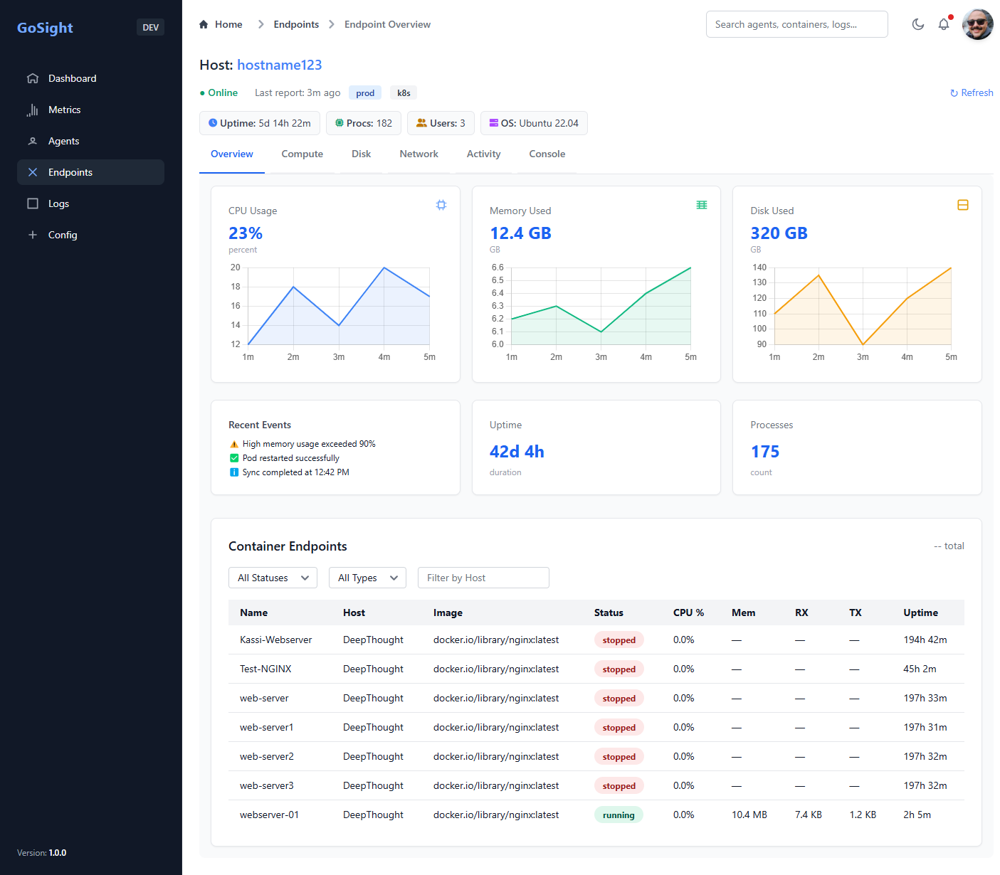
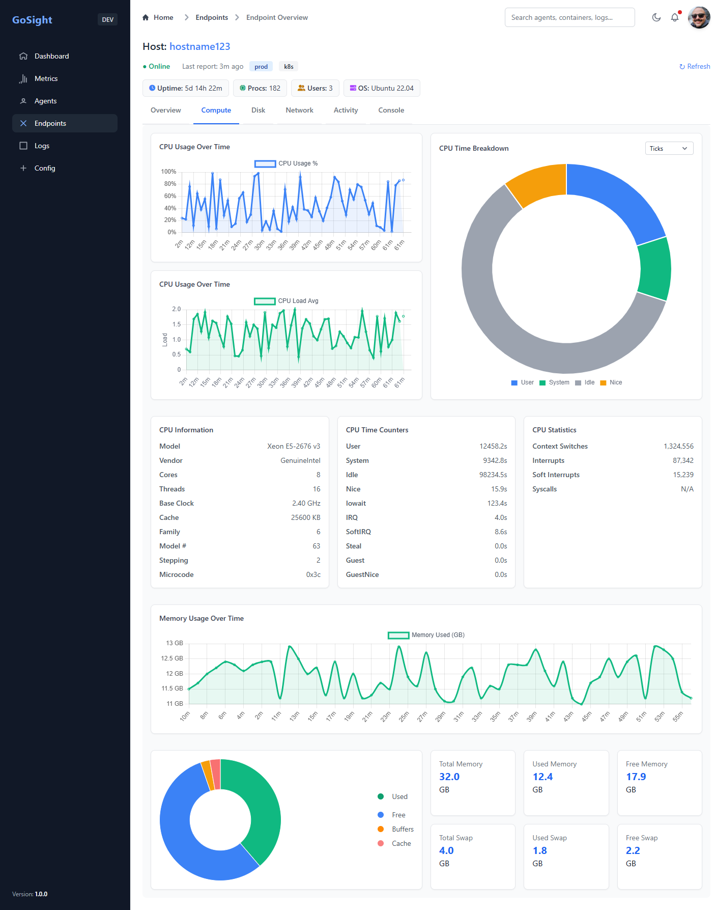
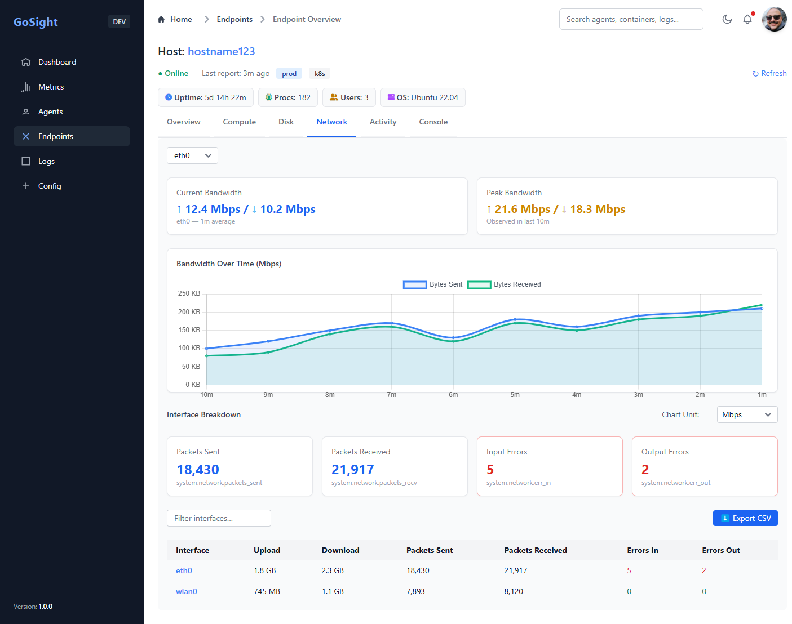

> 🚧 **Development Status**
>
> GoSight is under active development and **not yet production-ready**... However, many core features are already working:
>
> - Fully functional agent/server gRPC streaming  
> - TLS + mutual TLS (mTLS) with certificate auth  
> - Modular collector system (CPU, memory, disk, network, containers)  
> - Basic web dashboard (dark mode, metric tabs, container/host table)  
> - Auth package with SSO / RBAC + granular permissions
> - Rich metric / Log collection and storage in Time Series and in-memory db
> - Websocket broadcasting to live dashboard with charts
> - Powerful api query engine for metrics
>
> _Next up: full historical visualization, alerting/notification engine, log filtering/search, and advanced observability workflows for distributed and hybrid systems._
>
> 🔍 See [Project Status](https://github.com/aaronlmathis/gosight/blob/main/PROJECT_STATUS.md) for detailed progress.

---

## 🤝 Contributing

GoSight is early in its journey, and we’re actively looking for contributors to help shape it into a production-grade observability platform.

We especially welcome help with:

- 🖥️ **Frontend Development**  
  JavaScript, HTML, CSS, modern frameworks (Vue/React), UX design

- 🔧 **Backend Engineering**  
  Go, gRPC, PostgreSQL, observability/monitoring stacks

- 📊 **Data Visualization**  
  Chart.js, metrics dashboards, log interfaces

- 🧪 **Testing & QA**  
  Load testing, CI/CD, integration tests

If you're passionate about monitoring, metrics, or building high-performance systems in Go —  
**open an issue or email**: [aaron@gosight.dev](mailto:aaron@gosight.dev)

---

# GoSight

GoSight is a high-performance, modular, and vendor-agnostic observability platform written in Go. It includes a lightweight agent for collecting metrics on Windows, macOS, and Linux systems and a server that aggregates, stores, and exposes those metrics securely over gRPC. The agent is designed for minimal overhead and high performance, making it ideal for servers.

In addition to system and container metrics, GoSight will support ingesting telemetry from third-party services by:
- Exposing a flexible HTTP API for external collectors and custom integrations
- Pulling metrics from cloud provider APIs (e.g. AWS CloudWatch, GCP Monitoring, Azure Monitor)
- Listening to streaming sources like Amazon Kinesis, Google Pub/Sub, and Azure Event Hubs for real-time telemetry ingestion
- This extensible model allows GoSight to act as a central observability hub for hybrid environments, whether you're monitoring bare-metal, VMs, containers, serverless workloads, or external systems.

## ❓ Why GoSight?

Observability tools are often bloated, vendor-locked, or lack flexibility for hybrid environments. GoSight aims to be:

- 🔓 **Vendor-agnostic** — works with any backend (VictoriaMetrics, InfluxDB, Timescale, etc.)
- 🧩 **Modular** — easy to extend collectors or plug in new sources
- 🏎️ **Efficient** — built in Go for minimal footprint and fast performance
- 🔐 **Secure** — built-in mTLS, RBAC, and session-aware access control
- 🌐 **Unified** — collect, stream, visualize, and query from a single stack

| Feature                          | Status   | Notes                                 |
|----------------------------------|----------|----------------------------------------|
| System metrics (CPU, mem, disk, net)  | ✅ Done  | Cross-platform via gopsutil            |
| Container metrics (Podman/Docker)| ✅ Done  | Per-container stats with tags          |
| Log streaming support            | ✅ Done  | With proto model + gRPC stream         |
| Web dashboard                    | ✅ Done  | Built with Flowbite + Chart.js         |
| WebSocket live updates           | ✅ Done  | Real-time metric + log pushes          |
| Secure gRPC w/ mTLS              | ✅ Done  | Client/server auth with TLS certs      |
| User Auth + RBAC                 | ✅ Done  | JWT-based with role permissions        |
| Flexible query engine            | ✅ Done  | Filter by any metric/meta field        |
| Historical charting              | 🚧 Planned | Pull from VictoriaMetrics             |
| Alerting & thresholds            | 🚧 Planned | Basic rule engine, webhook-based      |

## 🧪 Components

### Agent
- Collects system metrics and logs
- Sends them over gRPC (TLS/mTLS) to the server
- Configurable via YAML config file, ENV variables, or flags

### Server
- Accepts incoming metrics / logs
- Verifies client identity (mTLS)
- Stores logs in VictoriaMetrics, via metric store interface (allowing for other storage providers)
- Keeps in-memory cache of metric data in Metric Index
- Exposes metrics and logs via live (webhook)/static dashboards
- Configurable via YAML config file, ENV variables, or flags

---

## 🚀 Quick Start (Dev)

```bash
# From project root
go run ./server/cmd &
go run ./agent/cmd
```

Ensure you’ve generated valid certificates before starting. Currently User / Data store only supports postgresql, which can be run via docker or full install. Database schema provided. Metric storage can be accomplished via Victoria Metrics container/install. 

---

## 🔐 TLS / mTLS Setup

Certs live in the `/certs` directory. You can regenerate everything using:

```bash
# Linux/macOS
./install/generate_certs_with_san.sh

# Windows PowerShell
./install/generate_certs_with_san.ps1
```

Update paths in `config.yaml` files accordingly.

---

## 📂 Folder Structure (Core)

```
/agent/         - Agent source code and CLI
/server/        - Server source code and CLI
/shared/        - Shared models and proto definitions
/certs/         - TLS and mTLS certificates
/install/       - Cert generation scripts
```

---

## 🛠 Build

```bash
go build -o gosight-agent ./agent/cmd
go build -o gosight-server ./server/cmd
```

### Overview Page


### Compute Page


### Network Page



---

## 📋 License

GoSight is licensed under the [GPL-3.0-or-later](https://www.gnu.org/licenses/gpl-3.0.html).


