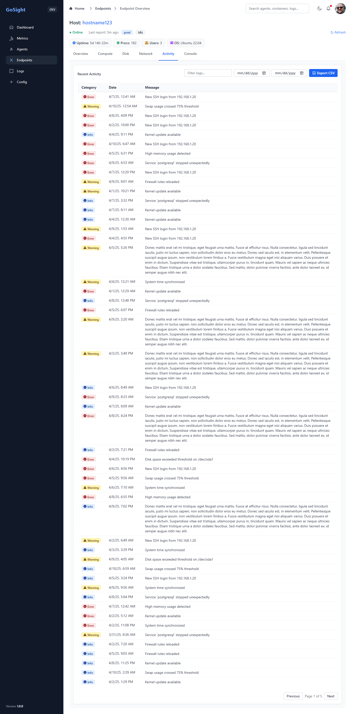

# GoSight

GoSight is a high-performance, modular, and vendor-agnostic observability platform written in Go. It includes a lightweight agent for collecting metrics on Windows, macOS, and Linux systems and a server that aggregates, stores, and exposes those metrics securely over gRPC. The agent is designed for minimal overhead and high performance, making it ideal for both servers and developer machines.

In addition to system and container metrics, GoSight will support ingesting telemetry from third-party services by:
- Exposing a flexible HTTP API for external collectors and custom integrations
- Pulling metrics from cloud provider APIs (e.g. AWS CloudWatch, GCP Monitoring, Azure Monitor)
- Listening to streaming sources like Amazon Kinesis, Google Pub/Sub, and Azure Event Hubs for real-time telemetry ingestion
- This extensible model allows GoSight to act as a central observability hub for hybrid environments, whether you're monitoring bare-metal, VMs, containers, serverless workloads, or external systems.

> 🚧 **Development Status**
>
> GoSight is under active development and **not yet production-ready**, but many core features are already working:
>
> - ✅ Fully functional agent/server gRPC streaming  
> - ✅ TLS + mutual TLS (mTLS) with certificate auth  
> - ✅ Modular collector system (CPU, memory, disk, network, containers)  
> - ✅ Basic web dashboard (dark mode, metric tabs, container/host table)  
> - ✅ Cert generation scripts for local dev  
>
> Next up: UserStore, historical views, alerts, and more.
>
> 🔍 See [Project Status](https://github.com/aaronlmathis/gosight/blob/main/PROJECT_STATUS.md) for detailed progress.


## 🌐 Project Overview

- 🔧 Written in pure Go for speed and portability
- 📦 Modular collector architecture (CPU, memory, disk, network, container)
- 🔐 Secure with full TLS and mutual TLS (mTLS) support
- 📊 Built-in web dashboard (HTML/JS)
- 🧰 Cross-platform: runs on Linux, Windows, and containers

## 🧪 Components

### Agent
- Collects system metrics
- Sends them over gRPC (TLS/mTLS) to the server
- Configurable via `agent/config.yaml`

### Server
- Accepts incoming metrics
- Verifies client identity (mTLS)
- Exposes metrics and dashboards
- Configurable via `server/config.yaml`

---

## 🚀 Quick Start (Dev)

```bash
# From project root
go run ./server/cmd &
go run ./agent/cmd
```

Ensure you’ve generated valid certificates before starting.

---

## 🔐 TLS / mTLS Setup

Certs live in the `/certs` directory. You can regenerate everything using:

```bash
# Linux/macOS
./install/generate_certs_with_san.sh

# Windows PowerShell
./install/generate_certs_with_san.ps1
```

Update paths in `config.yaml` files accordingly.

---

## 📂 Folder Structure (Core)

```
/agent/         - Agent source code and CLI
/server/        - Server source code and CLI
/shared/        - Shared models and proto definitions
/certs/         - TLS and mTLS certificates
/install/       - Cert generation scripts
```

---

## 🛠 Build

```bash
go build -o gosight-agent ./agent/cmd
go build -o gosight-server ./server/cmd
```

### Overview Page


### Compute Page


### Network Page


### Activity Page



---

## 📋 License

GoSight is licensed under the [GPL-3.0-or-later](https://www.gnu.org/licenses/gpl-3.0.html).
