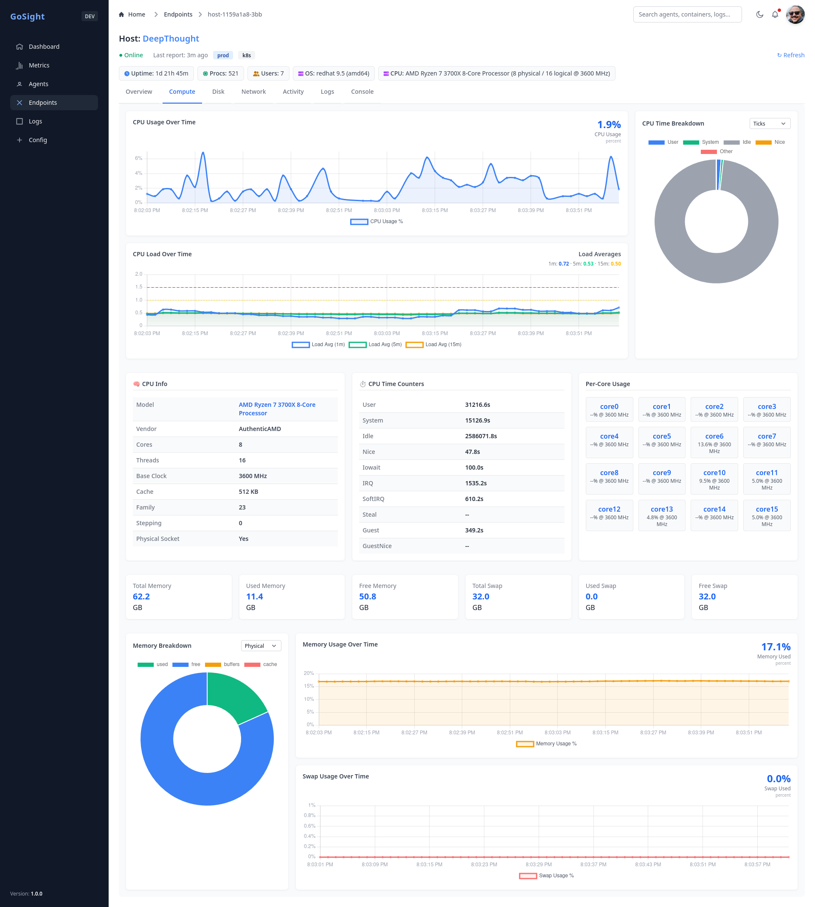

     [](https://goreportcard.com/report/github.com/aaronlmathis/gosight-server) [](https://goreportcard.com/report/github.com/aaronlmathis/gosight-agent) 
> 🚧 **Development Status**
>
> GoSight is under active development and **not yet production-ready**. However, many core features are implemented and functional:
>
> - Agent/server metric + log streaming via gRPC
> - SYSLOG ingestion over TCP/UDP 
> - Web dashboard with tabs, charts, and endpoint views  
> - TLS/mTLS authentication, JWT session handling  
> - Modular collectors: CPU, memory, disk, net, journald, eventlog, podman, docker  
> - Log and metric APIs for filtering and export  
> - Metric Explorer with multi-series charting  
> - Alerting system with flexible rule logic and route actions  
> - Permission-based access control  
>
> See [Project Status](https://github.com/aaronlmathis/gosight/blob/main/PROJECT_STATUS.md) for detailed roadmap.

# GoSight

GoSight is a high-performance, modular, and vendor-agnostic observability platform written in Go. It includes a lightweight agent for collecting metrics and logs from Windows, macOS, and Linux systems (including Docker and Podman containers), and a server that aggregates, stores, and exposes those metrics securely over gRPC, with TLS/mTLS.

GoSight supports a full observability pipeline including:
- System and container metrics (CPU, memory, disk, network, uptime, etc.)
- Structured and unstructured log collection (journald, flat files, syslog)
- Planned: Cloud-native metrics via extensible integrations (AWS CloudWatch, GCP Monitoring, Azure Monitor)
- WebSocket-based live streaming of telemetry
- Advanced alerting, filtering, and incident correlation
- Remote-safe command dispatch and automation hooks (Ansible runbooks)

---

## Core Features

- Robust metric and log collection on Windows, Linux, and macOS  
- Container observability via Docker and Podman  
- Secure agent-server communication using TLS/mTLS  
- Metric storage in VictoriaMetrics with in-memory indexing  
- Rich API for querying logs and metrics  
- Dynamic dashboard with tabs, charts, and filters (responsive UI)  
- **Metric Explorer** for building complex multi-series graphs with filters, grouping, aggregation, and timespan  
- **Alert Engine** supporting threshold-based and multi-condition rules with cooldowns and repeat intervals  
- **Action Routes** to send alerts via Webhook, Email, or execute a local Script (configurable routing)  
- **Incident View** with logs, metrics, and timeline context  
- Support for **approved command execution** (e.g. podman/docker or scripts) with safety checks
- Support for executing Ansible Runbooks on endpoints  
- Full **IAM support**: roles, permissions, SSO, RBAC, session security  

---

## 📚 Table of Contents
- [Why GoSight?](#why-gosight)  
- [Components](#components)  
- [Quick Start (Dev)](#quick-start-dev)  
- [Contributing](#contributing)  
- [TLS / mTLS Setup](#tls--mtls-setup)  
- [Build](#build)  
- [Screenshots](#dashboard)  
- [License](#license)  

---

## Why GoSight?

Observability tools are often bloated, vendor-locked, or inflexible. GoSight aims to be:

- **Vendor-agnostic** — works with any backend (VictoriaMetrics, InfluxDB, Timescale)  
- **Modular** — pluggable collectors and storage interfaces  
- **Efficient** — fast Go-based agents with minimal overhead  
- **Secure** — TLS/mTLS, signed JWTs, and RBAC  
- **Unified** — logs, metrics, dashboards, and alerts from a single stack  

---

## Components

### Agent
[`gosight-agent`](https://github.com/aaronlmathis/gosight-agent)
- Collects system metrics, container stats, and logs  
- Sends telemetry via gRPC (TLS/mTLS)  
- Supports runtime-safe command execution (whitelisted)  
- Configurable via YAML, env, or flags  

### Server
[`gosight-server`](https://github.com/aaronlmathis/gosight-server)
- Receives telemetry from agents  
- Stores metrics (VictoriaMetrics) and logs (compressed JSON or pluggable backend)  
- Hosts dashboards, WebSocket broadcasters, and API endpoints  
- Evaluates alert rules and dispatches actions via routes (email, webhook, script)  
- Exposes query endpoints for metric explorer and log search  

### Shared

- [`gosight-shared`](https://github.com/aaronlmathis/gosight-shared) – Shared proto definitions, model structs, and utilities


---

## Contributing

GoSight is early-stage and actively evolving. Contributions are welcome in all areas:

- Frontend: Tailwind UI, Flowbite, Charting (ApexCharts)  
- Backend: Go, gRPC, Alert evaluation, API design  
- Infra: Agent packaging, deployment, CI  
- UX: Log explorer, incident view, global search, whitelabel  

See [CONTRIBUTING.md](CONTRIBUTING.md) for setup and task ideas.

---

## Quick Start (Dev)

Clone the repo and run:

```bash
make dev
```

This will:
- Start PostgreSQL and VictoriaMetrics containers  
- Build and launch the GoSight server and agent  
- Generate TLS/mTLS certificates in the right location  

Access the dashboard at: `https://localhost:8443`

---

## TLS / mTLS Setup

Certs live under `/certs`. To regenerate:

```bash
# Linux/macOS
./install/generate_certs_with_san.sh

# Windows PowerShell
./install/generate_certs_with_san.ps1
```

Update `config.yaml` to match cert paths.

---

## Build

```bash
go build -o gosight-agent ./agent/cmd
go build -o gosight-server ./server/cmd
```

---

## Dashboard

### Metric Explorer  


### Home Dashboard  


### Endpoint Details (Disk Tab)  


### Compute Tab  


### Endpoint Summary Table  


### Overview Tab  


---

## License

GoSight is licensed under the [GPL-3.0-or-later](https://www.gnu.org/licenses/gpl-3.0.html).
